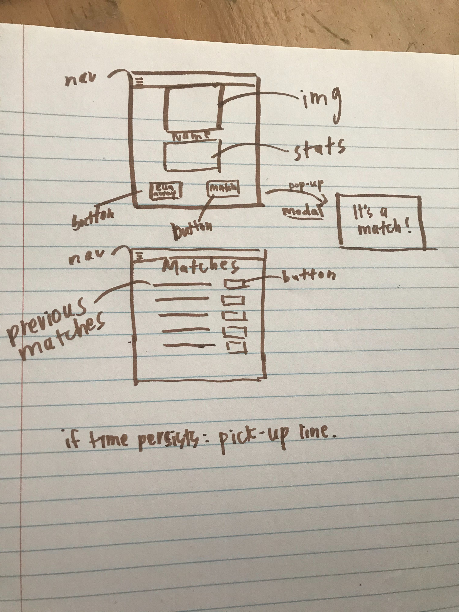

# spellbindr

Title: Spellbindr

Description: Create a randomized character using the D&D API. Match your new character against powerful wizards for a chance at a mythical relationship. Learn some of the basics of D&D gaming in short, sessionable bursts. 

User Story:
  As a lonely aspiring adventurer; 
  I want to create a random character and learn about basic D&D mechanics;
  So that I can match my new character against others for a chance to adventure together.

API's: D&D
       Random pickup line
       
Elevator Pitch: Always wanted to nerd out on D&D but don't have the time? Learn some of the basics of the game while building a character sheet and testing your charisma against the realm's most powerful wizards. Short session-style gaming with a chance for a legendary connection.