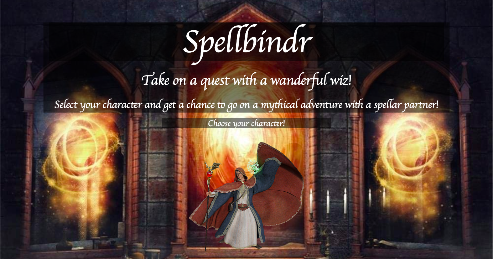
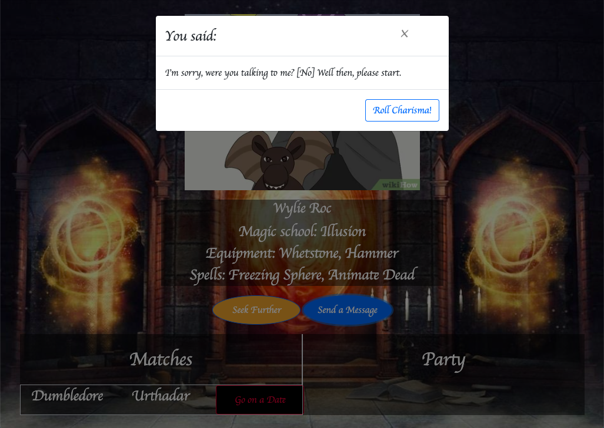
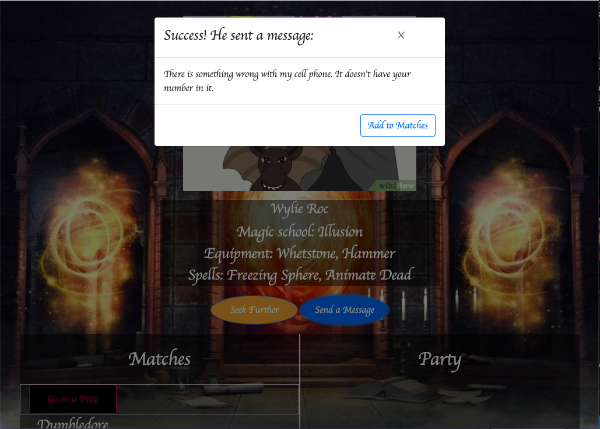
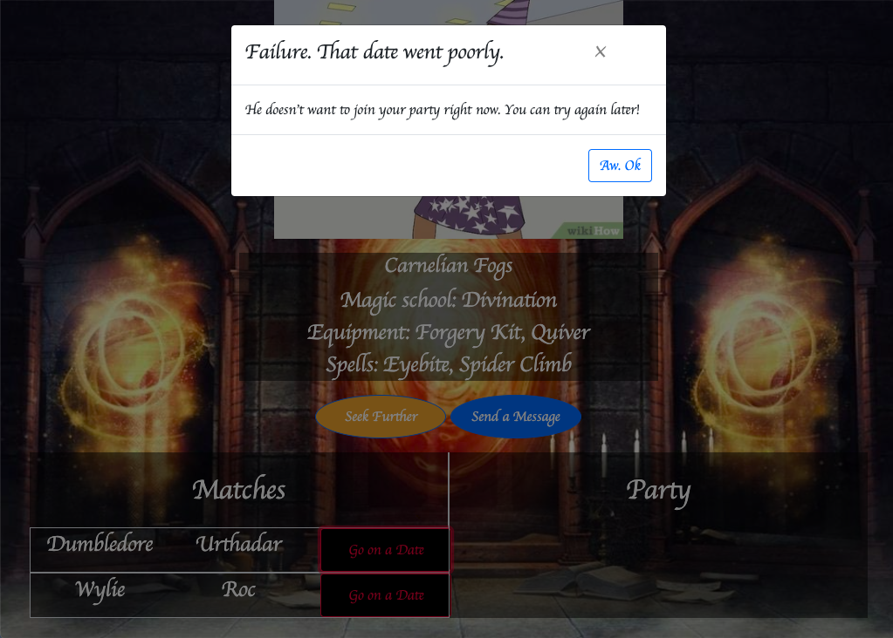

# Spellbindr

## Description
This was a team project built through the Georgia Tech Coding Bootcamp. This is a mini-game where user can create a randomized character using the D&D API. They then can match their new character against powerful wizards for a chance at a mythical relationship. Learn some of the basics of D&D gaming in short, sessionable bursts. 

## Table of Contents
* [Installation](#installation)
* [User-Story](#user-story)
* [Acceptance Criteria](#acceptance-criteria)
* [Usage](#usage)
* [API](#api's)
* [Elevator Pitch](#elevator-pitch)
* [Links](#links)
* [Credits](#credits)
* [License](#license)


## Installation

1. Clone the repo
2. Open index.html in default browser


## User Story
  As a lonely aspiring adventurer; 
  I want to create a random character and learn about basic D&D mechanics;
  So that I can match my new character against others for a chance to adventure together.

## Acceptance Criteria
```
WHEN I visit the page 
Then I am presented with a roll button to create my character
  SpellBindr logo, brief description, and start button 
  On click, page is wiped and first character profile is created

WHEN a character is created
  pulls from D&D api for random stats and classes
  pulled data will be appended to to page
THEN I can reroll for a new random profile
reroll button clears previous stats and generates new

WHEN I am happy with the character stats created
THEN I can save that character to local storage

WHEN I save the character
THEN I am brought to the gameplay page
  play game button saves character and moves to play page

WHEN I arrive at the gameplay page
THEN I am shown an eligible wizard
 on page load, populate element with random wizard image and name and D&D api to generate stats
 pull image and name from arrays

WHEN I see a wizard
THEN I can press the roll initiative or flee buttons
  roll initiative button moves to next step
  flee button rerolls wizard stats, image, and name

WHEN I press the like button
THEN I roll for match

WHEN I successfully roll to match
THEN I am presented with a random pickup line and the wizard is saved to my matches and a new wizard is generated
    appends saved wizard profile to screen

WHEN I unsuccessfully roll to match
THEN a new wizard is generated

WHEN I select a wizard from my saved matches
 Header with directions to click new saved card to send a pickup line
THEN I can send him a pickup line
    

WHEN the pickup line is sent
THEN I roll charisma to go on a dungeon date

WHEN the dungeon date is successful
THEN the wizard joins my party and is removed from saved matches
```
## Usage
The following screenshots shows some functionality of the project:





## API's 
  1. D&D
  2. Random pickup line
       
## Elevator Pitch
Always wanted to nerd out on D&D but don't have the time? Learn some of the basics of the game while building a character sheet and testing your charisma against the realm's most powerful wizards. Short session-style gaming with a chance for a legendary connection.


## Links
[Github Repository](https://github.com/arhamilton92/spellbindr)

[Deployed Website](https://arhamilton92.github.io/spellbindr/)

## Credits
Credits to the project members: Andrea Hamilton(arhamilton92), Mark Mooney(mjmoon15), Preston Bradford(YukariTalksTanks), and Sharon Kim(sharonkim09).

Additional Credits to https://pixabay.com/images/search/wizard/ and https://www.shutterstock.com/ for the wizard images. 
## License

MIT License

Copyright (c) [2020] [Andrea Hamilton, Mark Mooney, Preston Bradford, Sharon Kim]

Permission is hereby granted, free of charge, to any person obtaining a copy
of this software and associated documentation files (the "Software"), to deal
in the Software without restriction, including without limitation the rights
to use, copy, modify, merge, publish, distribute, sublicense, and/or sell
copies of the Software, and to permit persons to whom the Software is
furnished to do so, subject to the following conditions:

The above copyright notice and this permission notice shall be included in all
copies or substantial portions of the Software.

THE SOFTWARE IS PROVIDED "AS IS", WITHOUT WARRANTY OF ANY KIND, EXPRESS OR
IMPLIED, INCLUDING BUT NOT LIMITED TO THE WARRANTIES OF MERCHANTABILITY,
FITNESS FOR A PARTICULAR PURPOSE AND NONINFRINGEMENT. IN NO EVENT SHALL THE
AUTHORS OR COPYRIGHT HOLDERS BE LIABLE FOR ANY CLAIM, DAMAGES OR OTHER
LIABILITY, WHETHER IN AN ACTION OF CONTRACT, TORT OR OTHERWISE, ARISING FROM,
OUT OF OR IN CONNECTION WITH THE SOFTWARE OR THE USE OR OTHER DEALINGS IN THE
SOFTWARE.


---
